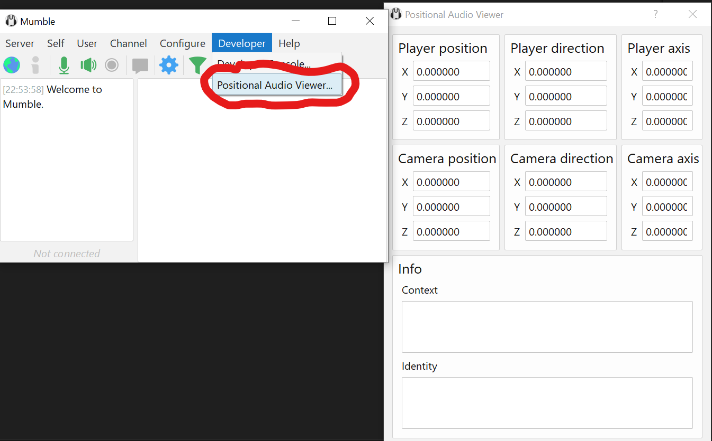

# Factorio Proximity Chat

Proximity/positional audio in Factorio!


## To install

- Download [Mumble](https://www.mumble.info/) voice chat software
- Install [mumble plugin](https://github.com/alifeee/MumblePlugin-FactorioPositionalAudio/releases) (see [below](#mumble-plugin-installation) for more info)
- Install Factorio mod ["Proximity Voice Chat"](https://mods.factorio.com/mod/proximity-voice-chat) (see [below](#factorio-mod-installation) for more info)
- Enable Positional Audio (PA) in Mumble
- Done!
  
  PA will enable when you are in the same game server.

  

### Mumble plugin installation

1. Download the latest `factorio.mumble_plugin` from the [releases page](https://github.com/alifeee/MumblePlugin-FactorioPositionalAudio/releases).
1. Install the plugin in Mumble
  
1. Enable positional audio
  
1. Done! To check it works, try the positional audio viewer (requires [Mumble v1.5](https://www.mumble.info/downloads/#development-snapshots))
  

### Factorio mod installation

Install the [Proximity voice chat mod](https://mods.factorio.com/mod/proximity-voice-chat) in-game.


## Development

### Mumble plugin

All files are in [`./mumble`](./mumble/)

The main plugin is in [`plugin.c`](./mumble/plugin.c). For development guide, see [plugin docs](https://github.com/mumble-voip/mumble/blob/master/docs/dev/plugins/README.md). This plugin reads player position information from the file on disk (via the Factorio mod) and attaches to the Mumble Positional Audio API.

#### Building (via Actions)

The [GitHub actions](https://github.com/alifeee/MumblePlugin-FactorioPositionalAudio/actions) build the plugin for Windows and Linux. The plugin is output as a file `factorio.mumble_plugin` in the `bundle` artifact (deleted after 1 day).

#### Building (locally)

##### Linux (Ubuntu)

Install GCC and make

```bash
sudo apt install gcc
sudo apt install make
```

Run build commands

```bash
cmake -S ./mumble/ -B ./build/ && make -C ./build
```

##### Windows

Install [Visual Studio Build Tools] with "Desktop development in C++"

[Visual Studio Build Tools]: https://visualstudio.microsoft.com/downloads/#build-tools-for-visual-studio-2022


Run commands (PowerShell). This will make a local Windows-only plugin (in `build/factorio.mumble_plugin`). You must manually install it into mumble by unloading any previous plugin, and installing this.

```bash
cmake -S .\mumble\ -B .\build\ -DCMAKE_C_COMPILER=cl; cmake --build .\build\ --config Release; bash package_windows.sh
```

### Factorio mod

All files are in [`./factorio`](./factorio/).

The mod itself is very simple, and consists of a single control script in [`control.lua`](./factorio/control.lua). This script dumps relevant information to a text file every few frames.

Mod information is held in [`info.json`](./factorio/info.json).

Example file output:

```text
XYZ, Player, sUrface, Server
x: 5.65625
y: -2.8359375
z: 0
p: 1
u: 1
s: alifeee
```

#### File location

The log file is put in [`%application directory%`](https://wiki.factorio.com/Application_directory)`/script-output/mumble_positional-audio_information.txt`.

On Windows, that's

```path
%APPDATA%/Factorio/script-output/mumble_positional-audio_information.txt
```
