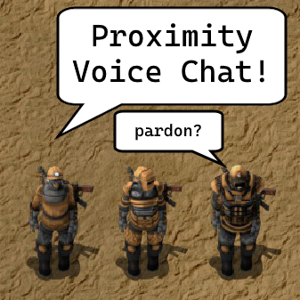
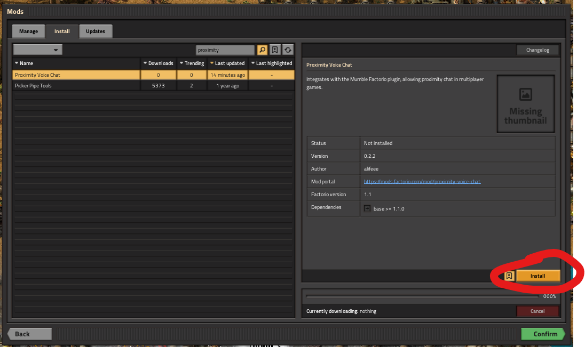

# Factorio Proximity Chat

Proximity/positional audio in Factorio!

⚠⚠ CURRENTLY NOT WORKING - PLEASE WAIT - SEE GITHUB ⚠⚠

You must use [Mumble](https://www.mumble.info/) for voice chat. This mod integrates with their [positional audio technology](https://wiki.mumble.info/wiki/Positional-Audio).

## Installation

- Download [Mumble](https://www.mumble.info/) voice chat software
- Install [mumble plugin](https://github.com/alifeee/MumblePlugin-FactorioPositionalAudio/releases) (see [below](#mumble-plugin-installation) for more info)
- Install Factorio mod ["Proximity Voice Chat"](https://mods.factorio.com/mod/proximity-voice-chat) (see [below](#factorio-mod-installation) for more info)
- Enable Positional Audio (PA) in Mumble
- Done!
  
  PA will enable when you are in the same game server.

  

### Mumble plugin installation

1. Download the latest `factorio.mumble_plugin` from the [releases page](https://github.com/alifeee/MumblePlugin-FactorioPositionalAudio/releases).
1. Install the plugin in Mumble
  
1. Enable positional audio
  
1. Done! To check it works, try the positional audio viewer (requires [Mumble v1.5](https://www.mumble.info/downloads/#development-snapshots))
  

### Factorio mod installation

Install the [Proximity voice chat mod](https://mods.factorio.com/mod/proximity-voice-chat) in-game.

